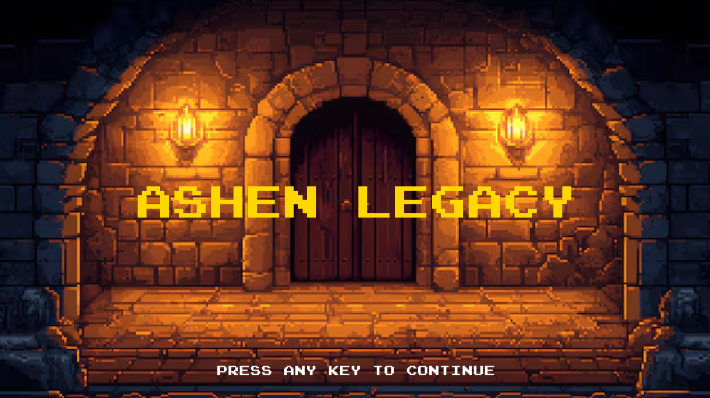
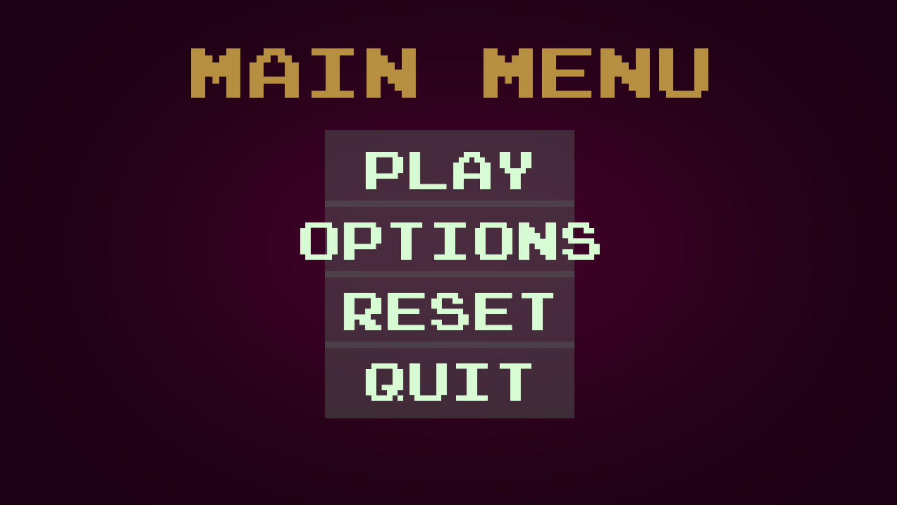
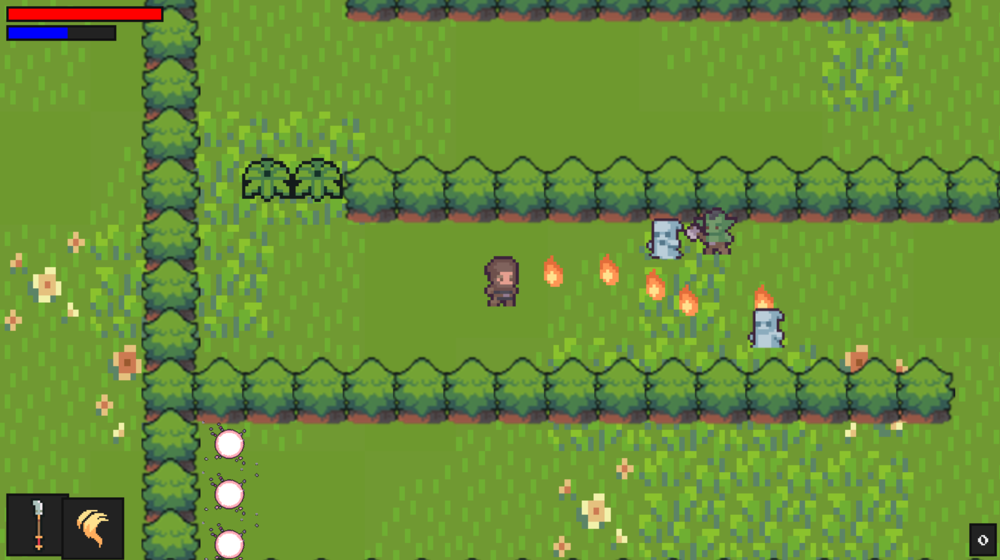
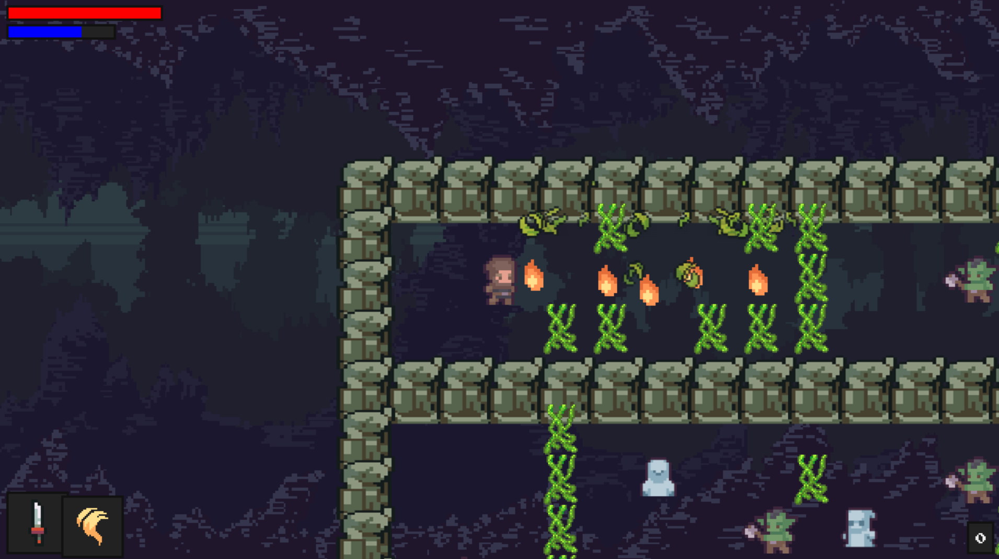
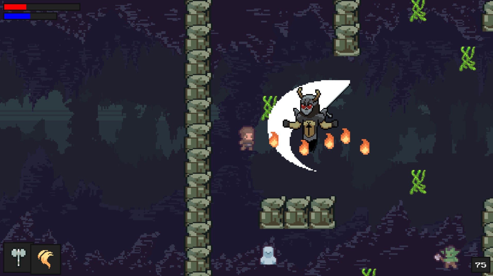
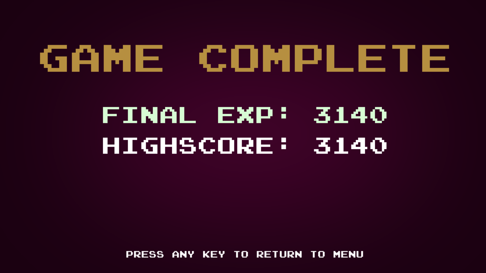

# Ashen Legacy

Ashen Legacy is a 2D RPG game developed in Python using Pygame as a Grade 11 computer science project.

## Documentation

An official game guide is included in the repository:
- Ashen Legacy (Official Game Guide).docx

## Features

- Multiple levels
- Enemy AI
- Boss battles
- Magic system
- Character progression
- Save/load functionality

## Screenshots

### Title Screen

### Main Menu

### Forest Level

### Dungeon Level

### Boss Battle

### Victory Screen

